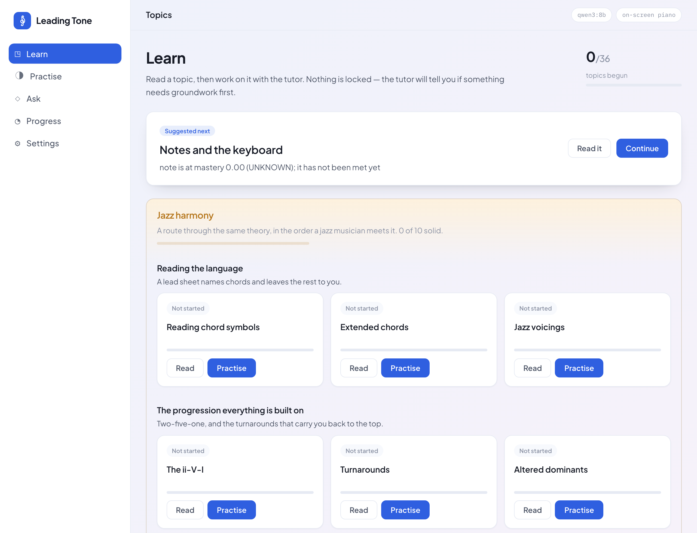
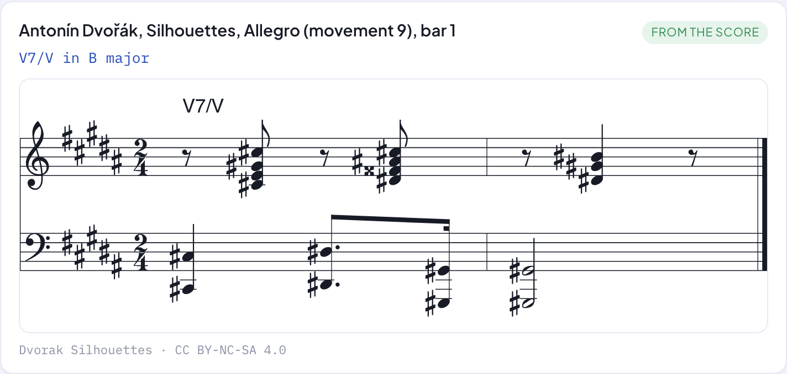
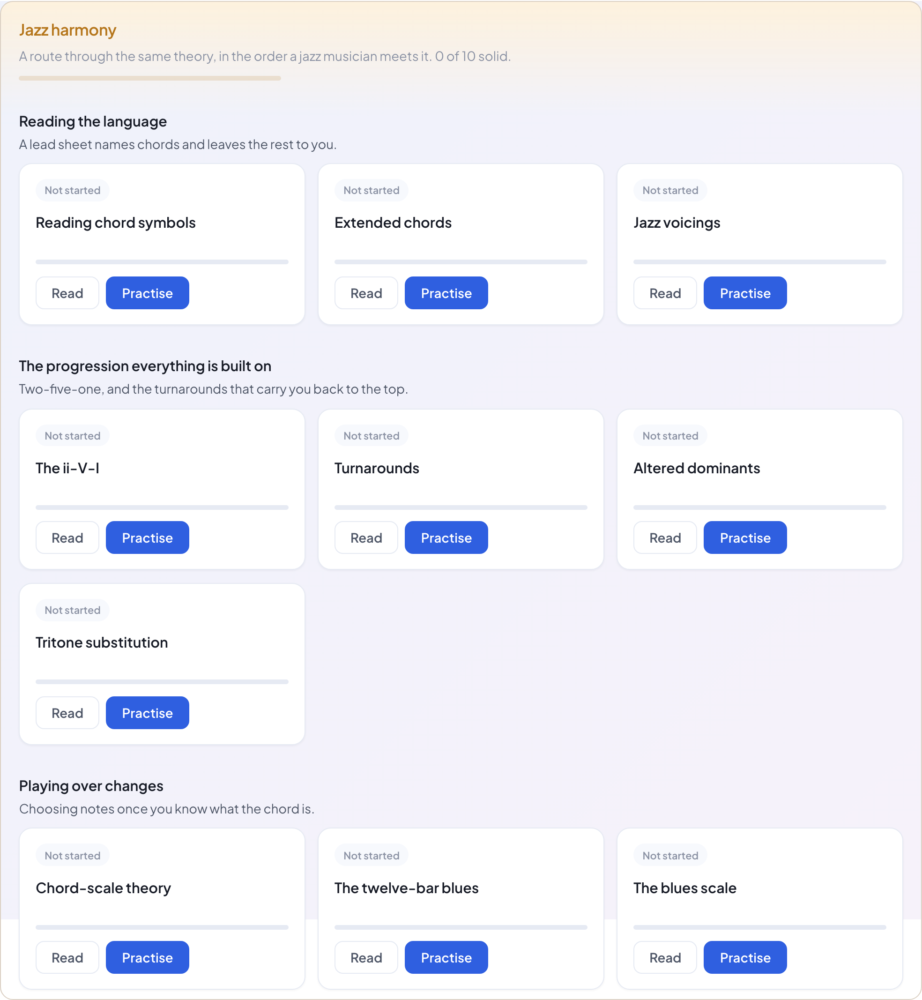
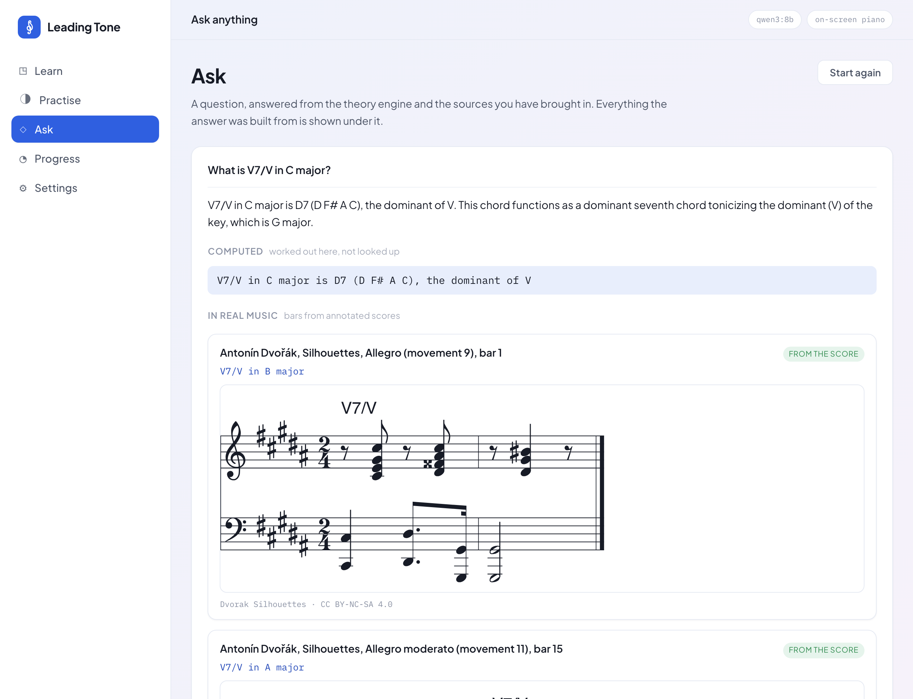
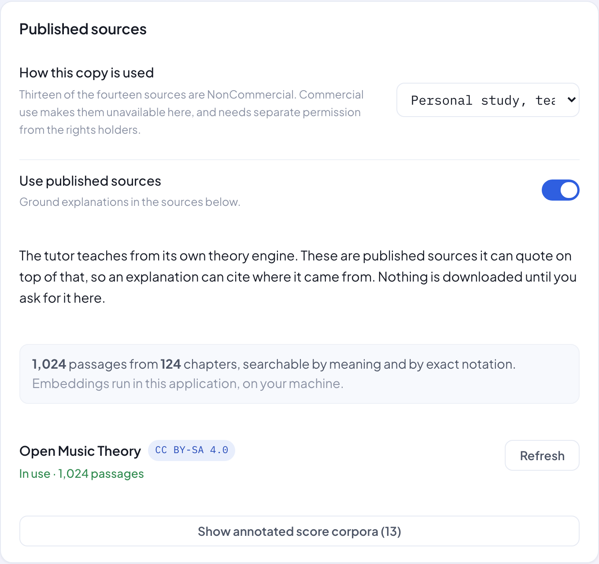

# Leading Tone

A music-theory tutor that teaches you, rather than testing you against a fixed syllabus.

*The leading tone is the note that pulls you to where you have to go next. So is this.*

It keeps a model of what you actually know, decides what to teach from that, explains it,
sets the question, and marks the answer — including one you play on a keyboard. It covers
notes through to species counterpoint, by way of Roman numerals, cadences, extended
chords, the ii-V-I and tritone substitution, with a route through jazz harmony for anyone
who came for that.

It can also read. Bring in Open Music Theory and twelve corpora of annotated scores, and
explanations come with a citation and examples come from real music — Beethoven's actual
bars, engraved, with the harmony marked. When no real example exists it says so rather than
inventing one.

---

## What it looks like

The catalogue, with what you have covered and what is ready to read next.



A lesson, and under it the same harmony in real music — actual bars from an annotated
score, with the chord marked and the source cited. **Nothing on this page was written by a
language model,** and when no real example exists it says so rather than inventing one.



A route through jazz harmony for anyone who came for that. The same theory, in the order a
jazz musician meets it.



Ask it something directly, and see what the answer was built from — computed here, quoted
from a source, or found in a score.



Sources are brought in from Settings. Nothing downloads until you ask, and each one shows
its licence where you decide.



---

## Install it

Download the build for your machine, open it, and it starts. **Nothing else to install** —
no Java, no database, no Docker, no configuration file, no Python and no vector database.
The search index and the embedding model run inside the application itself.

| | |
|---|---|
| macOS | `Leading Tone-1.0.0.dmg` |
| Windows | `Leading Tone-1.0.0.msi` |
| Linux | `leading-tone_1.0.0_amd64.deb` |

It opens your browser onto the interface when it starts, preferring Chrome, Edge or Firefox
if you have one — those are the browsers that can talk to a MIDI keyboard, and Safari cannot.
Everything else works in any browser.

Your progress lives in one folder, which you can copy or delete:

| | |
|---|---|
| macOS | `~/Library/Application Support/Leading Tone` |
| Windows | `%APPDATA%\Leading Tone` |
| Linux | `~/.local/share/leading-tone` |

> These builds are not yet signed, so macOS and Windows will say the developer is
> unidentified. On macOS, open **System Settings → Privacy & Security** and choose **Open
> Anyway**; on Windows, choose **More info → Run anyway**.

### Or run the jar

Java 21, one file, and it behaves exactly as it always has — `data/` beside the jar, and no
browser opened for you.

```bash
java -jar leading-tone-runner.jar
```

Then open **http://localhost:8088**.

### Bring in the sources (optional)

Under **Settings → Published sources**, choose what to read. Open Music Theory takes about
three minutes; the score corpora a few seconds each. Nothing downloads until you ask, and
each source shows its licence before you choose it.

Afterwards the tutor cites what it quotes, and shows real passages in notation. Everything
downloaded is kept locally, so rebuilding never goes back to the publisher.

### Add a teacher's voice (optional)

Without a language model the tutor still works — it decides, explains and marks exactly the
same, just in plainer words and instantly. For prose, install [Ollama](https://ollama.com)
and pull a model:

```bash
ollama pull qwen3:8b
```

Then pick it under **Settings** in the app. Nothing to restart.

| Your RAM | Model |
|---|---|
| 8 GB | `qwen3:4b` |
| 16 GB | `qwen3:8b` — the default |
| 32 GB+ | `qwen3:30b-a3b` — noticeably better teaching |

### A piano (optional)

There is one on screen, so you never need an instrument. It has a voice, and answers you
click are marked exactly like answers you play.

For a real MIDI keyboard, use **Chrome or Edge** — Safari and Firefox do not implement Web
MIDI. Plug it in before loading the page.

---

## Using it

**Learn** — every topic, grouped by area, with where you are in each. Open one and read it
before anything is asked: what it is, the facts, and worked examples in notation.

**Practise** — the tutor itself. It picks what to work on from what you know, or you pick,
and it tells you if something needs groundwork first. Answer by typing or at the piano. Ask
it anything at any time; asking is never marked wrong.

**Ask** — a question box, for the question you have now rather than the one the tutor
chose. The answer comes back with the material it was built from: what the theory engine
computed, the passages quoted and who published them, and any real bars that were found. If
nothing was found it says so. It answers with the model switched off too, more plainly.

**Progress** — what it believes you know, and the evidence behind every bit of it. Naming a
chord counts for less than playing one, which counts for less than explaining it. Nothing
here can be raised by guessing.

**Settings** — the model, how it is tuned, and what to call you. All of it kept in the
database and changeable while the app runs.

---

## Build it from source

Java 21, Node 20+ and pnpm.

```bash
git clone git@github.com:davidlapetina/leading-tone.git
cd leading-tone
make package
cd backend && java -jar target/leading-tone-runner.jar
```

`make run` does both. The jar carries the interface, the API and the database driver.

### Working on it

```bash
make backend     # API on 8088, hot reload
make frontend    # interface on 5173, hot reload
```

`make backend-offline` runs the tutor with no language model, which is instant and
deterministic — the best way to work on the teaching itself.

### Tests

```bash
make test        # backend and frontend
make test-e2e    # browser, against a running backend
make check       # all of the above, plus lint, typecheck and the jar
```

An installer for the machine you are on:

```bash
make app         # a .dmg, .msi or .deb, with a trimmed Java runtime inside
```

jpackage cannot cross-compile, so each one is built on its own system; the
[release workflow](.github/workflows/release.yml) does all three.

**413 tests, and 14 more in the browser. None of them need Docker, a database, a network or
a language model.** The backend runs against an in-memory database; ingestion is tested
against recorded copies of the real publisher responses; the browser tests switch the model
off, so they test the tutor rather than a model's wording.

---

## How it works

**The language model teaches. It does not decide, and it does not mark.**

Which concept, which kind of task, how hard, the question itself, the verdict on your
answer, and every mastery figure are computed in Java and covered by tests. The model is
handed a decision and asked for the words. It has a `proposeEvidence` tool and there is no
`setMastery` to call.

That is why turning it off changes the wording and nothing else.

- **Nothing is a lesson plan.** 36 concepts with prerequisites, not a syllabus. The route
  through them comes from what you have demonstrated, and is different for everyone.
- **The theory is computed, not remembered.** Chords, scales, Roman numerals, cadences and
  parallel fifths are all worked out by an engine that knows F♯ and G♭ are different notes.
  The lessons are generated by that same engine, so what you read and what you are marked
  against cannot disagree.
- **Evidence is kept, not just scores.** Every answer is stored with what it was worth and
  what it did to your mastery. *Why does it think I understand inversions?* is answerable
  from rows in a table.
- **It fails honestly.** No model, a slow model, a model returning nonsense, no keyboard —
  each degrades to something usable and says which. None of them touch what it knows about
  you.

More in [docs/](docs/): the [architecture](docs/architecture.md), the
[learner model](docs/learner-model.md), the [teaching policy](docs/tutoring-policy.md) and
the [concept graph](docs/concept-model.md).

The knowledge layer — published sources, licensing, retrieval and the theory engine — has
its own notes in [docs/knowledge/](docs/knowledge/README.md).

## Your data

It is yours, and it is one file. **Settings → Export** takes everything away as JSON:
concepts, evidence, mistakes. **Start over** deletes it. `make wipe` does the same from a
terminal.

## Licence

The application is MIT. See [LICENSE](LICENSE).

The published sources it can quote are **not** MIT. Open Music Theory is CC BY-SA 4.0; the
annotated score corpora and the Jazz Harmony Treebank are CC BY-NC-SA 4.0. Ingesting,
chunking, embedding or indexing that material does not relicense it, and does not remove
an attribution, ShareAlike or NonCommercial obligation. See
[THIRD_PARTY_NOTICES.md](THIRD_PARTY_NOTICES.md), and `licenses/` for the full texts.

Nothing is downloaded until you ask for it, in Settings.
